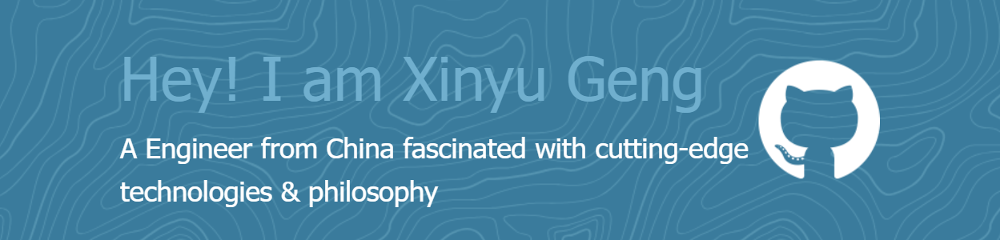

  

<h3 align="left">Languages and Tools:</h3>

           

|  |  |
| ------------- | ------------- |

<picture>
  <source media="(prefers-color-scheme: dark)" srcset="https://raw.githubusercontent.com/lxfriday/lxfriday/output/github-contribution-grid-snake-dark.svg">
  <source media="(prefers-color-scheme: light)" srcset="https://raw.githubusercontent.com/lxfriday/lxfriday/output/github-contribution-grid-snake.svg">
  
</picture>
