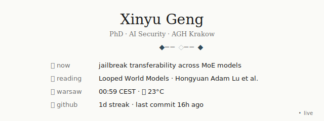

<!-- card-href:start --><!-- card-href:end -->

#### ──── research ────

Adversarial robustness of LLMs · Jailbreaking · Red-teaming
Multi-agent AI security · LLM evaluation

#### ──── papers ────

<!-- papers:start -->
- **▸ wip** — Jailbreak transferability across MoE
- **▸ wip** — Multi-agent prompt injection
- **▸ under review** — Eval harness for safety alignment
<!-- papers:end -->

#### ──── building ────

- **◇ autoresearch** — multi-agent eval orchestrator
- **◇ rl-safety** — RL with safety reward models
- **◇ pipeline** — transformer pipeline framework

#### ──── news ────

<!--news:start-->

*updated 2026-06-17*

▸ 波兰警方确认俄罗斯持不同政见者身份
▸ 波兰与德国签署防务协议
▸ 波兰狼群首次捕猎野牛
▸ 波兰规划美军常驻军事基地
▸ 富士康波兰芯片工厂年产40万电动车
▸ 波兰河流发现11世纪古剑

⤷ [Full digest →](NEWS.md)
<!--news:end-->

⤷ [Full digest →](NEWS.md)

#### ──── elsewhere ────

[github](https://github.com/CHLCCGA) · [linkedin](https://www.linkedin.com/in/xinyu-geng/) · [cv](https://shin-resume.vercel.app) · [kaggle](https://www.kaggle.com/chlccga)

· · ·

