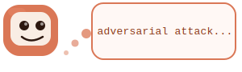

---

## Research Interests

- Adversarial robustness of LLMs (jailbreaking, prompt injection, red-teaming)
- Agentic AI security (multi-agent attack surfaces)
- LLM evaluation and safety benchmarking

---

## Skills

| Research & AI | Engineering & Systems |
|:---|:---|
| PyTorch &middot; HuggingFace &middot; Adversarial ML | Claude Code &middot; Codex &middot; Multi-Agent Orchestration |
| LLM Fine-tuning &middot; PEFT &middot; Quantization | HPC / SLURM &middot; Distributed Training |
| Multimodal (LLaVA &middot; CLIP) &middot; RAG | Python &middot; TypeScript &middot; SQL &middot; Linux |

---

<table><tr>
<td valign="top" width="320">

</td>
<td valign="top">

## Featured Projects

| Project | Description | Tech |
|:---|:---|:---|
| autoresearch | Autonomous multi-agent research coordination | AutoGen &middot; Claude Code &middot; Python |
| [RL+LLM Research](https://github.com/CHLCCGA/LLM) | Reinforcement learning with LLM reward models | PyTorch &middot; HuggingFace |
| [LLM Framework](https://github.com/CHLCCGA/LLM) | Transformers, quantization, and PEFT pipeline | HuggingFace &middot; bitsandbytes |
| [Kaggle Loan Prediction](https://github.com/CHLCCGA/Kaggle/tree/main/lap) | Top 22% (820/3858), ensemble methods | XGBoost &middot; sklearn |

📚 More: [view all repositories](https://github.com/CHLCCGA?tab=repositories)

</td>
</tr></table>

---

<table><tr>
<td valign="top" width="90">

</td>
<td valign="top" width="100%">

<picture>
  <source media="(prefers-color-scheme: dark)" srcset="https://raw.githubusercontent.com/CHLCCGA/CHLCCGA/main/assets/github-snake-dark.svg">
  <source media="(prefers-color-scheme: light)" srcset="https://raw.githubusercontent.com/CHLCCGA/CHLCCGA/main/assets/github-snake.svg">
  
</picture>

</td>
</tr></table>

---

[LinkedIn](https://www.linkedin.com/in/xinyu-geng/) &middot; [Kaggle](https://www.kaggle.com/chlccga) &middot; [LeetCode](https://leetcode.com/u/gengjiaxinyu/) &middot; [Gmail](mailto:gengjiaxinyu@gmail.com)

