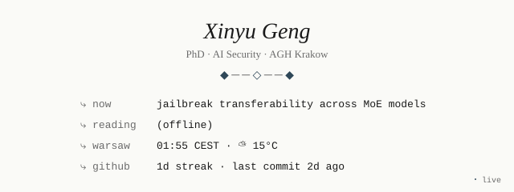

<!-- card-href:start --><!-- card-href:end -->

#### ──── research ────

Adversarial robustness of LLMs · Jailbreaking · Red-teaming
Multi-agent AI security · LLM evaluation

#### ──── papers ────

<!-- papers:start -->
- **▸ wip** — Jailbreak transferability across MoE
- **▸ wip** — Multi-agent prompt injection
- **▸ under review** — Eval harness for safety alignment
<!-- papers:end -->

#### ──── building ────

- **◇ autoresearch** — multi-agent eval orchestrator
- **◇ rl-safety** — RL with safety reward models
- **◇ pipeline** — transformer pipeline framework

#### ──── news ────

<!--news:start-->

*updated 2026-08-23*

▸ 波兰法律与公正党内部分裂
▸ 波兰测试时速 250 公里高铁
▸ 波兰召见以色列大使抗议调查终止
▸ 新任形象推广官文件存在错误备受批评
▸ 华沙新开炸鱼餐厅与亚洲菜餐厅
▸ AI 如何影响学生的人际关系

<!--news:end-->

⤷ [Full digest →](NEWS.md)

#### ──── elsewhere ────

[github](https://github.com/CHLCCGA) · [linkedin](https://www.linkedin.com/in/xinyu-geng/) · [cv](https://shin-resume.vercel.app) · [kaggle](https://www.kaggle.com/chlccga)

· · ·

