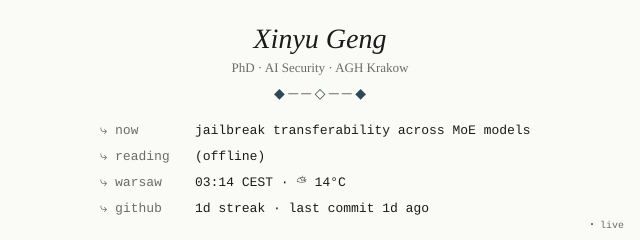

<!-- card-href:start --><!-- card-href:end -->

#### ──── research ────

Adversarial robustness of LLMs · Jailbreaking · Red-teaming
Multi-agent AI security · LLM evaluation

#### ──── papers ────

<!-- papers:start -->
- **▸ wip** — Jailbreak transferability across MoE
- **▸ wip** — Multi-agent prompt injection
- **▸ under review** — Eval harness for safety alignment
<!-- papers:end -->

#### ──── building ────

- **◇ autoresearch** — multi-agent eval orchestrator
- **◇ rl-safety** — RL with safety reward models
- **◇ pipeline** — transformer pipeline framework

#### ──── news ────

*updated 2026-10-09*

▸ 波兰政府推动审查 Paramount 对电视台 TVN 的控制权
▸ Rondo Bagels ── 波兰面包房登陆 Powiśle
▸ 阿莲娜·萨波奇尼科夫 / 奈里·巴格拉姆扬 ── 联合展览
▸ XIV 皇家光影节
▸ Giselle 芭蕾舞剧
▸ 波兰推出 1.14 亿欧元空间技术基金

[Full digest →](NEWS.md)

#### ──── elsewhere ────

[github](https://github.com/CHLCCGA) · [linkedin](https://www.linkedin.com/in/xinyu-geng/) · [cv](https://shin-resume.vercel.app) · [kaggle](https://www.kaggle.com/chlccga)

· · ·

